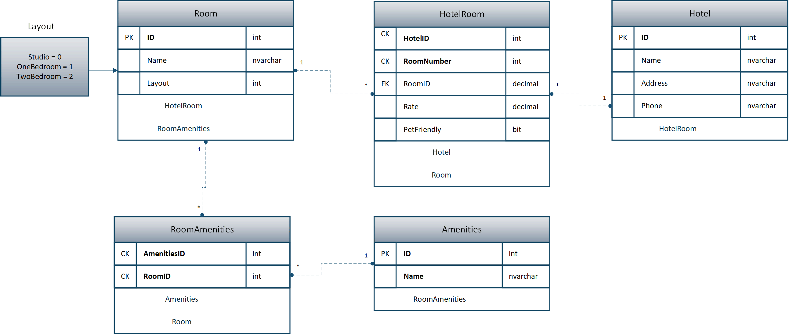

# Async-Inn
## Description
This is a WebApp written for the Async Inn Corporation to assist in managing their hotel chain.  Users can add, edit, and delete Hotels, Rooms, Amenities, and Rooms to hotels.

## Database Schema

## Schema Explanation
This database has 5 tables: Room, Room Amenities, Amenities, Hotel, and Hotel Room.
### Amenities
Have an ID and a Name. Links to Room Amenities.
### Room
Have an ID, Name, and Layout taken from an enumeration. Links to Hotel Room and Room Amenities.
### Room Amenities
Join table for Room and Amenities tables.
### Hotel
Have an ID, Name, Address, and Phone number. Links to Hotel Room.
### Hotel Room
Joint Entity Table with Payload. Links to Hotel and Rooms. Adds RoomID, nightly Rate, and if the room is Pet Friendly